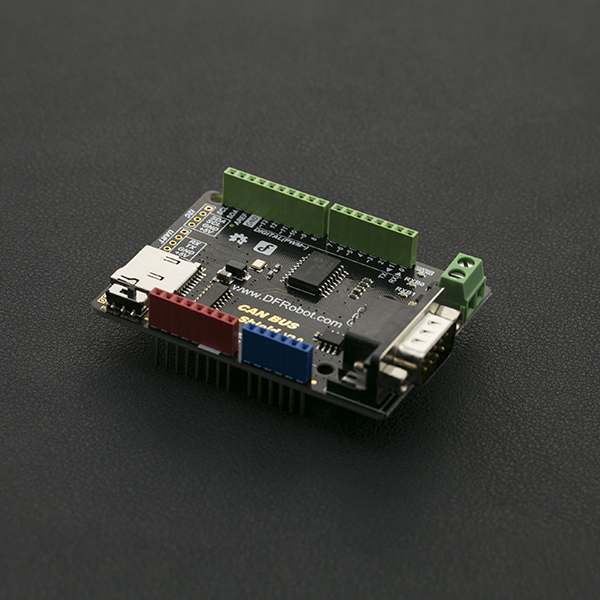

# DFRobot_MCP2515
* [中文版](./README_CN.md)

CAN-BUS is a common industrial bus because of its long travel distance, medium communication speed and high reliability. It is commonly found on modern machine tools and as an automotive diagnostic bus. This CAN-BUS Shield adopts MCP2515 CAN Bus controller with SPI interface and MCP2551 CAN transceiver to give your Arduino/Seeeduino CAN-BUS capibility. With an OBD-II converter cable added on and the OBD-II library imported, you are ready to build an onboard diagnostic device or data logger.




## Product Link (https://www.dfrobot.com/product-1444.html)
    SKU: DFR0370


## Table of Contents

* [Summary](#summary)
* [Installation](#installation)
* [Methods](#methods)
* [Compatibility](#compatibility)
* [History](#history)
* [Credits](#credits)


## Summary

- Implements CAN V2.0B at up to 1 Mb/s
- SPI Interface up to 10 MHz
- Standard (11 bit) and extended (29 bit) data and remote frames
- Two receive buffers with prioritized message storage
- Industrial standard 9 pin sub-D connector
- Two LED indicators


## Installation

There two methods:

1. To use this library, first download the library file, paste it into the \Arduino\libraries directory, then open the examples folder and run the demo in the folder.
2. Search the DFRobot_SCD4X library from the Arduino Software Library Manager and download it.


## Methods

```C++

    /**
     * @fn DFRobot_MCP2515
     * @brief the DFRobot_MCP2515 class' constructor.
     * @param csPin - indicate the spi select pin when mcu commication with the can controler e.i MCP2515
     * @return None
     */
    DFRobot_MCP2515(uint8_t csPin);

    /**
     * @fn begin
     * @brief config the the Can baud rate,  buffer, and interrupt.
     * @param speedset - MCP2515 can config rate
     * @return if successful, it return CAN_OK, or CAN_FAILINIT
     */
    uint8_t begin(uint8_t speedset);

    /**
     * @fn initMask
     * @brief initialize the mask register. 
     * @param maskerNum - maybe set MCP2515_RXM0 or MCP2515_RXM1.
     * @param ext - extend flag. if ext = 1, indicate the frame is extended frame.
     * @param ulData - initialization data
     * @return the status. if success, return MCP2515_OK.
     */
    uint8_t initMask(eMasker_t maskerNum, uint8_t ext, uint32_t ulData);

    /**
     * @fn initFilter
     * @brief initialize the fileter register. 
     * @param filterNum - maybe set MCP2515_RXF0, MCP2515_RXF1、 MCP2515_RXF2、 MCP2515_RXF3、 MCP2515_RXF4、 MCP2515_RXF5.
     * @param ext - extend flag. if ext = 1, indicate the frame is extended frame.
     * @param Data - fileter data
     * @return the status. if success, return MCP2515_OK.
     */
    uint8_t initFilter(eFilter_t filterNum, uint8_t ext, uint32_t Data);

    /**
     * @fn getCanId
     * @brief get the id of the data cached in Can controller currently.
     * @return return the id number.
     */
    uint32_t getCanId(void);

    /**
     * @fn isRemoteRequest
     * @brief tell whether the current data frame buffered in Can controller is remote requestion frame.
     * @return return the id number.
     */
    uint8_t isRemoteRequest(void);

    /**
     * @fn isExtendedFrame
     * @brief tell whether the current data frame buffered in Can controller is extended frame.
     * @return return the id number.
     */
    uint8_t isExtendedFrame(void);

    /**
     * @fn checkReceive
     * @brief check whether data is cached by Can controler.
     * @return if there are some data received by Can controller. the return value is CAN_MSGAVAIL, or CAN_NOMSG.
     */
    uint8_t checkReceive(void);

    /**
     * @fn checkError
     * @brief check whether there is the control error on the Can bus line.
     * @return if control error don't occur, return CAN_OK, or return CAN_CTRLERROR.
     */
    uint8_t checkError(void);

    /**
     * @fn sendMsgBuf
     * @brief send one data frame.
     * @param id - the message id num.
     * @param ext - extend flag. if ext = 1, indicate the frame is extended frame.
     * @param len - the len of the data to send.
     * @param buf - the data to send.
     * @return the status. if success, return MCP2515_OK.
     */
    uint8_t sendMsgBuf(uint32_t id, uint8_t ext, uint8_t len, uint8_t *buf);

    /**
     * @fn sendMsgBuf
     * @brief send the remote requestion message. 
     * @param id - the message id num. 
     * @param ext - extend flag. if ext = 1, indicate the frame is extended frame.
     * @param len - the len of the data to send.
     * @param rtr - the flag of the remote requestion. if rtr = 1, the frame seem as the remote requestion frame , or the frame is the normal data frame..
     * @param buf - the data to send.
     * @return the status. if success, return MCP2515_OK.
     */
    uint8_t sendMsgBuf(uint32_t id, uint8_t ext, uint8_t rtr, uint8_t len, uint8_t *buf);

    /**
     * @fn readMsgBuf
     * @brief read one data frame from the cache in inner can controler. 
     * @param len - the len of the data to read.
     * @param buf - the data out from the Can controler store into the buf.
     * @return the status. if success, return MCP2515_OK.
     */
    uint8_t readMsgBuf(uint8_t *len, uint8_t *buf);

    /**
     * @fn readMsgBufID
     * @brief read one data frame from the cache in inner Can controler with the indicated ID, 
     * @n  if Can controler has not cached the ID's Frame the return value is not CAN_OK.
     * @param ID - ID number.
     * @param len - the len of the data to read.
     * @param buf - the data out from the Can controler store into the buf.
     * @return the status. if success, return MCP2515_OK. or this read operation is failed.
     */
    uint8_t readMsgBufID(uint32_t *ID, uint8_t *len, uint8_t *buf);

```


## Compatibility

MCU                | Work Well    | Work Wrong   | Untested    | Remarks
------------------ | :----------: | :----------: | :---------: | :----:
Arduino Uno        |      √       |              |             |
Arduino MEGA2560   |      √       |              |             |
Arduino Leonardo   |      √       |              |             |


## History

- 2022/05/25 - Version 1.0.0 released.
- 2022/10/18 - Version 1.0.1 released.


## Credits

Written by Arduinolibrary, 2022. (Welcome to our [website](https://www.dfrobot.com/))

