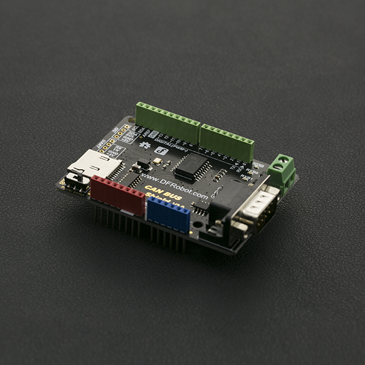

# DFRobot_MCP2515
* [English Version](./README.md)

CAN-BUS由于其传输距离长、通信速度中等、可靠性高等特点，是一种常用的工业总线。它在现代机床和汽车诊断总线上普遍存在。该CAN总线屏蔽采用带有SPI接口的MCP2515 CAN总线控制器和MCP2551 CAN收发器，实现Arduino/Seeeduino CAN总线功能。随着OBD-II转换器电缆的添加和OBD-II库的导入，您可以准备构建一个板载诊断设备或数据记录器。




## 产品链接 (https://www.dfrobot.com.cn/goods-1264.html)
    SKU: DFR0370

## 目录

* [概述](#概述)
* [库安装](#库安装)
* [方法](#方法)
* [兼容性](#兼容性)
* [历史](#历史)
* [创作者](#创作者)


## 概述

* 支持标准帧、扩展帧收发，支持轮询和中断两种接收方式
* 提供uart、I2C、DB9及接线柱等多种接口
* 支持SD卡数据存储
* 支持Arduino主板供电以及DB9接口供电


## 库安装

这里有2种安装方法：

1. 使用此库前，请首先下载库文件，将其粘贴到\Arduino\libraries目录中，然后打开examples文件夹并在该文件夹中运行演示。
2. 直接在Arduino软件库管理中搜索下载 DFRobot_MCP2515 库。


## 方法

```C++

    /**
     * @fn DFRobot_MCP2515
     * @brief  构造函数
     * @param csPin - 单片机与can控制器MCP2515通信时的spi选择引脚
     * @return None
     */
    DFRobot_MCP2515(uint8_t csPin);

    /**
     * @fn begin
     * @brief 配置Can波特率、缓冲区和中断
     * @param speedset - MCP2515可以配置速率
     * @return 如果成功，它返回CAN_OK或CAN_FAILINIT
     */
    uint8_t begin(uint8_t speedset);

    /**
     * @fn initMask
     * @brief 初始化掩码寄存器
     * @param maskerNum - 可以设置MCP2515_RXM0或MCP2515_RXM1
     * @param ext - 扩展帧标记, ext = 1表示扩展帧
     * @param ulData - 初始化数据
     * @return 掩码初始化状态。如果成功，返回MCP2515_OK。
     */
    uint8_t initMask(eMasker_t maskerNum, uint8_t ext, uint32_t ulData);

    /**
     * @fn initFilter
     * @brief 初始化过滤器寄存器
     * @param filterNum - 可以设置 MCP2515_RXF0、 MCP2515_RXF1、 MCP2515_RXF2、 MCP2515_RXF3、 MCP2515_RXF4、 MCP2515_RXF5
     * @param ext - 扩展帧标记, ext = 1表示扩展帧
     * @param Data - 过滤器参数
     * @return 过滤器初始化状态。如果成功，返回MCP2515_OK。
     */
    uint8_t initFilter(eFilter_t filterNum, uint8_t ext, uint32_t Data);

    /**
     * @fn getCanId
     * @brief 获取当前缓存在Can控制器中的数据的id
     * @return 返回id号
     */
    uint32_t getCanId(void);

    /**
     * @fn isRemoteRequest
     * @brief 判断当前缓存在Can控制器中的数据帧是否为远程请求帧
     * @return 返回id号
     */
    uint8_t isRemoteRequest(void);

    /**
     * @fn isExtendedFrame
     * @brief 判断当前缓存在Can控制器中的数据帧是否为扩展帧
     * @return 返回id号
     */
    uint8_t isExtendedFrame(void);

    /**
     * @fn checkReceive
     * @brief 检查数据是否被Can控制器缓存
     * @return 如果Can控制器接收到一些数据。返回值是CAN_MSGAVAIL或CAN_NOMSG。
     */
    uint8_t checkReceive(void);

    /**
     * @fn checkError
     * @brief 检查Can总线线路是否有控制错误
     * @return 如果控制错误没有发生，返回CAN_OK，或者返回CAN_CTRLERROR。
     */
    uint8_t checkError(void);

    /**
     * @fn sendMsgBuf
     * @brief 发送一个数据帧
     * @param id - 消息的id号
     * @param ext - 扩展帧标记, ext = 1表示扩展帧
     * @param len - 要发送的数据的长度
     * @param buf - 要发送的数据
     * @return 数据发送状态。如果成功，返回MCP2515_OK。
     */
    uint8_t sendMsgBuf(uint32_t id, uint8_t ext, uint8_t len, uint8_t *buf);

    /**
     * @fn sendMsgBuf
     * @brief 发送远程请求消息
     * @param id - 消息的id号
     * @param ext - 扩展帧标记, ext = 1表示扩展帧
     * @param len - 要发送的数据的长度
     * @param rtr - 远程请求的标志。如果RTR = 1，则该帧为远程请求帧，否则为是正常的数据帧。
     * @param buf - 要发送的数据
     * @return 数据发送状态。如果成功，返回MCP2515_OK。
     */
    uint8_t sendMsgBuf(uint32_t id, uint8_t ext, uint8_t rtr, uint8_t len, uint8_t *buf);

    /**
     * @fn readMsgBuf
     * @brief 从can控制器内部的缓存中读取一个数据帧
     * @param len - 要读取的数据的长度
     * @param buf - 数据从Can控制器存储到buf
     * @return 数据读取状态。如果成功，返回MCP2515_OK。
     */
    uint8_t readMsgBuf(uint8_t *len, uint8_t *buf);

    /**
     * @fn readMsgBufID
     * @brief 从Can控制器内部的缓存中读取一个指定ID的数据帧，如果Can控制器没有缓存该ID的帧，返回值就不是MCP2515_OK。
     * @param ID - 消息的id号
     * @param len - 要读取的数据的长度
     * @param buf - 数据从Can控制器存储到buf
     * @return 数据读取状态。如果成功，返回MCP2515_OK， 否则读取操作失败。
     */
    uint8_t readMsgBufID(uint32_t *ID, uint8_t *len, uint8_t *buf);

```


## 兼容性

MCU                | Work Well    | Work Wrong   | Untested    | Remarks
------------------ | :----------: | :----------: | :---------: | :----:
Arduino Uno        |      √       |              |             |
Arduino MEGA2560   |      √       |              |             |
Arduino Leonardo   |      √       |              |             |


## 历史

- 2022/05/25 - 1.0.0 版本
- 2022/10/18 - 1.0.1 版本


## 创作者

Written by Arduinolibrary, 2022. (Welcome to our [website](https://www.dfrobot.com/))

